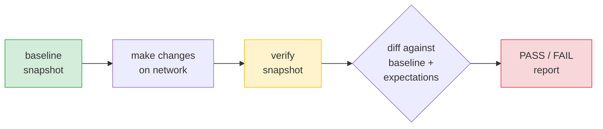
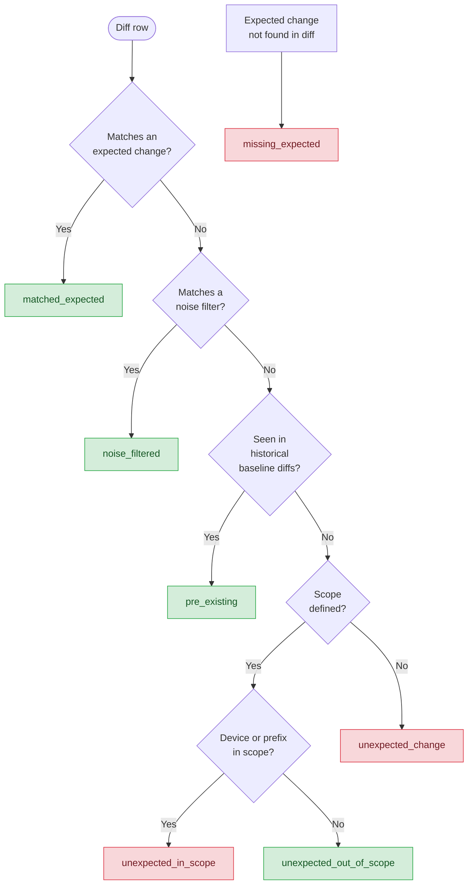

# cn-route — Routing Baseline Verifier

A standalone CLI tool for capturing and comparing network routing state across change windows. It connects to Cisco IOS/IOS-XE devices via SSH, collects routing tables, BGP, OSPF, and OMP state, then diffs snapshots against declared expectations to verify that only intended changes occurred.

---

## Table of Contents

- [Workflow](#workflow)
- [Commands](#commands)
  - [baseline](#baseline--capture-pre-change-state)
  - [verify](#verify--capture-and-compare-post-change-state)
  - [diff](#diff--compare-two-snapshots)
  - [expect-template](#expect-template--generate-expectation-yaml-template)
  - [expect-from-diff](#expect-from-diff--generate-expectations-from-diff-results)
  - [report](#report--rebuild-excel-workbook)
- [Global Options](#global-options)
- [Device Inventory](#device-inventory)
- [Expectations YAML](#expectations-yaml)
  - [Structure](#structure)
  - [Sections and Required Fields](#sections-and-required-fields)
  - [Operations (add, remove, change)](#operations)
  - [Host and VRF Targeting](#host-and-vrf-targeting)
  - [allow_unexpected](#allow_unexpected)
- [Noise Filters](#noise-filters)
- [Scope-Aware Classification](#scope-aware-classification)
- [Historical Baseline Detection](#historical-baseline-detection)
- [Classification Priority](#classification-priority)
- [Combining All Features](#combining-all-features)
- [Configuration](#configuration)
- [What Gets Collected](#what-gets-collected)
- [Output Structure](#output-structure)
- [Excel Report](#excel-report)
- [Exit Codes](#exit-codes)
- [Use Cases](#use-cases)

---

## Workflow

The tool follows a **baseline -> change -> verify** workflow:



1. **Baseline**: Capture routing state before the change window opens.
2. **Verify**: Capture post-change state, diff against baseline, match results against an expectation file.
3. **Diff**: Compare any two snapshots directly (no expectations file needed).
4. **Report**: Regenerate the Excel workbook from saved artifacts (no SSH needed).

---

## Commands

Production deployments expose `cn-route` as an alias to `cn-route.py`. In a repo checkout without that alias, run the same commands as `python cn-route.py ...`.

### `baseline` — Capture pre-change state

Connects to every device and collects routes, BGP, and OSPF state for the global namespace plus any discovered VRFs. On SD-WAN devices it also collects OMP peers in the global namespace, and optionally OMP TLOCs when `--omp-tlocs` is enabled. Saves a snapshot and Excel report.

```bash
cn-route baseline <change_id> -f <devices_file>
```

| Argument | Required | Description |
|----------|----------|-------------|
| `change_id` | Yes | Change/request identifier (e.g. `CHG-12345`, `INC-999`) |
| `-f`, `--devices-file` | Yes | Path to device inventory file (text or CSV) |

**Example:**

```bash
export TACACS_PW='mypassword'
cn-route baseline CHG-12345 -f devices.txt
```

**Exit codes:** `0` = success, `2` = one or more devices failed collection.

---

### `verify` — Capture and compare post-change state

Collects current state, diffs against the latest baseline, then classifies every difference using the [classification priority](#classification-priority) system.

```bash
cn-route verify <change_id> --expect <expectations.yaml> [options]
```

| Argument | Required | Description |
|----------|----------|-------------|
| `change_id` | Yes | Must match the baseline's change_id |
| `--expect` | Yes | Path to the expectations YAML file |
| `-f`, `--devices-file` | No | Override device inventory; defaults to cached inventory from baseline |
| `--history-depth N` | No | Compare against N previous baselines to detect pre-existing changes (default: 0) |

**Example:**

```bash
cn-route verify CHG-12345 --expect expect.yaml
```

**With historical detection:**

```bash
cn-route verify CHG-12345 --expect expect.yaml --history-depth 3
```

**Exit codes:** `0` = verification passed, `1` = verification failed, `2` = collection errors.

**Terminal output:**

```
============================================================
Verification: PASS
  Matched expected:          3
  Noise filtered:            2
  Pre-existing:              1
  Unexpected (in scope):     0
  Unexpected (out of scope): 4
  Missing expected:          0

  MATCHED EXPECTED (3):
    [+] 10.10.10.0/24
    |   R1/global: O via 192.0.2.1 Gi0/0
    ...

  NOISE FILTERED (2):
    [~] 0.0.0.0/0
    |   R5/global: next_hop changed -- Default route flaps
    ...

  PRE-EXISTING (1):
    [~] 172.16.99.0/24
    |   R7/global: metric changed

  UNEXPECTED OUT OF SCOPE (4):
    [+] 192.168.200.0/24
    |   R99/global: S via 10.0.0.1
    ...
============================================================
```

---

### `diff` — Compare two snapshots

Compare any two saved snapshots without writing an expectations file. Useful for quick ad-hoc comparisons.

```bash
cn-route diff <diff_args...> [-f <devices_file>]
```

**Argument patterns (2-4 positional tokens):**

| Pattern | Description |
|---------|-------------|
| `CHG-A CHG-B` | Compare latest snapshots from two change IDs |
| `CHG REF current` | Compare a stored snapshot against live collection |
| `CHG-A REF-A CHG-B REF-B` | Compare specific runs from two change IDs |

**Reference tokens:**

| Token | Description |
|-------|-------------|
| `baseline`, `verify`, `snapshot`, `diff` | Latest run of that kind |
| `20260307T120000Z` (timestamp) | Specific run_id |
| `current` | Collect live data from devices (requires `-f`) |
| Bare change_id | Only valid in the 2-token form `diff CHG-A CHG-B`; resolves to the latest run of any kind for that change ID |

In the `CHG REF current` and `CHG-A REF-A CHG-B REF-B` forms, each `REF` must be a run kind (`baseline`, `verify`, `snapshot`, `diff`) or a run ID timestamp.

**Examples:**

```bash
# Compare latest snapshots from two change requests
cn-route diff CHG-100 CHG-200

# Compare baseline against live state
cn-route diff CHG-123 baseline current -f devices.txt

# Compare specific timestamped runs
cn-route diff CHG-100 20260307T120000Z CHG-200 20260307T150000Z

# Compare baseline vs verify of the same change
cn-route diff CHG-100 baseline CHG-100 verify
```

Each `diff` command saves a dedicated `diff/` run and workbook for later review.

**Terminal output:**

```
============================================================
Diff: CHG-001/baseline/20260307T120000Z  vs  CHG-002/baseline/20260307T150000Z
  Total changes: 3

  Routes (2):
    R1: added 10.10.10.0/24
    R2: attribute_changed 10.20.0.0/16 [next_hop: 1.1.1.1 -> 2.2.2.2]

  BGP Neighbors (1):
    R1: removed 192.0.2.9

  OSPF Neighbors: no changes
  OSPF LSDB: no changes
============================================================
```

---

### `expect-template` — Generate expectation YAML template

Produces a fully-commented YAML template with all sections, identity fields, changeable fields, and commented-out examples for noise filters and scope.

```bash
cn-route expect-template [-o <output_file>]
```

| Argument | Required | Description |
|----------|----------|-------------|
| `-o`, `--output` | No | Output file path (default: print to stdout) |

**Examples:**

```bash
# Print to stdout
cn-route expect-template

# Write to file, then edit
cn-route expect-template -o expect.yaml
```

---

### `expect-from-diff` — Generate expectations from diff results

Auto-generates a valid expectations YAML from a stored diff or verify run. The output can be reviewed, edited, and used with `cn-route verify`.

```bash
cn-route expect-from-diff <change_id> [--run-kind <kind>] [--run-id <id>] [--only-unexpected] [-o <output_file>]
```

| Argument | Required | Description |
|----------|----------|-------------|
| `change_id` | Yes | Change/request identifier |
| `--run-kind` | No | Run type to read from: `diff` or `verify` (default: newest saved `verify` or `diff` run) |
| `--run-id` | No | Specific run timestamp |
| `--only-unexpected` | No | Verify runs only: include `unexpected_change` and `unexpected_in_scope` rows; warns and is ignored for diff runs |
| `--set-change-id` | No | Override the change_id in generated YAML |
| `--description` | No | Set a description in generated YAML |
| `-o`, `--output` | No | Output file path (default: print to stdout) |

**Examples:**

```bash
# Auto-detect latest diff or verify run
cn-route expect-from-diff CHG-12345

# From a specific diff run, write to file
cn-route expect-from-diff CHG-12345 --run-kind diff -o expect.yaml

# Only unexpected changes from a verify run
cn-route expect-from-diff CHG-12345 --run-kind verify --only-unexpected -o expect.yaml
```

When sourcing from a verify run without `--only-unexpected`, the generated file includes rows classified as `matched_expected`, `unexpected_change`, and `unexpected_in_scope`. It skips `missing_expected`, `noise_filtered`, `pre_existing`, and `unexpected_out_of_scope` rows because those do not translate cleanly into new expectations.

**Workflow — baseline, diff, then verify with generated expectations:**

```bash
# 1. Capture baseline
cn-route baseline CHG-12345 -f devices.txt

# 2. Make network changes, then diff against baseline
cn-route diff CHG-12345 baseline current -f devices.txt

# 3. Generate expectations from the diff
cn-route expect-from-diff CHG-12345 --run-kind diff -o expect.yaml

# 4. Review and edit expect.yaml as needed

# 5. Verify with the expectations
cn-route verify CHG-12345 --expect expect.yaml
```

---

### `report` — Rebuild Excel workbook

Regenerates the Excel report from saved JSON artifacts. No SSH connection needed.

```bash
cn-route report <change_id> [--run-kind <kind>] [--run-id <id>]
```

| Argument | Required | Description |
|----------|----------|-------------|
| `change_id` | Yes | Change/request identifier |
| `--run-kind` | No | Select run kind: `baseline`, `verify`, `snapshot`, `diff` |
| `--run-id` | No | Select a specific run by timestamp ID |

**Examples:**

```bash
# Rebuild latest report for a change
cn-route report CHG-12345

# Rebuild a specific baseline report
cn-route report CHG-12345 --run-kind baseline

# Rebuild a specific run by timestamp
cn-route report CHG-12345 --run-id 20260307T120000Z
```

---

## Global Options

These options apply to all commands:

```
-c, --config             Path to additional .cn config file
-l, --log-file           Override log file path
--log-level              DEBUG | INFO | WARNING | ERROR | CRITICAL
--output-dir             Override output directory
--workers N              Parallel SSH connections (default: 20, max: 100)
--per-device-sessions N  SSH sessions per device (default: 3, max: 8)
--timeout N              SSH command timeout in seconds (default: 120)
--username USER          Username (defaults to $USER)
--password PASS          Password (prefer TACACS_PW env var)
--no-prompt              Skip interactive credential prompts
--dns                    Enable reverse DNS lookups during parsing
--no-dns                 Skip reverse DNS lookups
--infoblox               Enable Infoblox prefix enrichment
--no-infoblox            Disable Infoblox prefix enrichment
--ospf-lsdb              Collect OSPF LSDB (disabled by default)
--omp-tlocs              Collect OMP TLOCs on SD-WAN devices (disabled by default)
--by-device              Use device-centric terminal output instead of prefix-centric
```

**Credentials:** Set the `TACACS_PW` environment variable instead of using `--password`, which is visible in process listings.

---

## Device Inventory

The tool accepts two inventory formats.

### Plain text (one hostname per line)

```
router1.example.net
router2.example.net
# comments and blank lines are ignored
```

All devices default to `cisco_ios` on port 22.

### CSV (with per-device options)

```csv
host,device_type,port,username,password
router1.example.net,cisco_ios,22,,
router2.example.net,cisco_xe,22,,
router3.example.net,cisco_ios,2222,localadmin,localpass
```

| Column | Default | Description |
|--------|---------|-------------|
| `host` | (required) | Hostname or IP |
| `device_type` | `cisco_ios` | Netmiko device type (`cisco_ios`, `cisco_xe`) |
| `port` | `22` | SSH port |
| `username` | global | Per-device username override |
| `password` | global | Per-device password override |
| `secret` | (none) | Enable secret for privileged mode |

Credentials in CSV files are stripped when the inventory is cached — only hostnames, device types, and ports are stored.

---

## Expectations YAML

The expectations file declares what routing changes you expect after the change window. Anything not listed is flagged as unexpected.

### Structure

```yaml
change_id: CHG-12345            # must match the CLI change_id
description: "Add new branch"   # optional human-readable note
allow_unexpected: false          # true = don't fail on unexpected diffs

expect:
  routes:
    add: []
    remove: []
    change: []
  bgp_prefixes:
    add: []
    remove: []
    change: []
  bgp_neighbors:
    add: []
    remove: []
    change: []
  ospf_neighbors:
    add: []
    remove: []
    change: []
  ospf_lsdb:
    add: []
    remove: []
    change: []
  omp_peers:
    add: []
    remove: []
    change: []
  omp_tlocs:
    add: []
    remove: []
    change: []

# Optional features (see dedicated sections below)
noise_filters: []
scope: {}
```

### Sections and Required Fields

| Section | Required fields | Optional fields |
|---------|----------------|-----------------|
| `routes` | `prefix` | |
| `bgp_prefixes` | `prefix` | `bgp_neighbor` |
| `bgp_neighbors` | `neighbor_ip` | |
| `ospf_neighbors` | `neighbor_ip` | |
| `ospf_lsdb` | `area`, `lsa_type`, `lsa_id`, `advertising_router` | |
| `omp_peers` | `peer_ip` | |
| `omp_tlocs` | `ip`, `color`, `encap` | |

### Operations

- **`add`**: Expect this record to appear (present in verify, absent in baseline).
- **`remove`**: Expect this record to disappear (present in baseline, absent in verify).
- **`change`**: Expect specific field values to change. Each field needs a `to` value; `from` is optional.

**Add example:**

```yaml
routes:
  add:
    - prefix: 10.20.30.0/24
      hosts: [router1, router2]
      namespace: BRANCH_VRF
```

**Remove example:**

```yaml
routes:
  remove:
    - prefix: 10.99.0.0/16
      hosts: [router1]
```

**Change example:**

```yaml
routes:
  change:
    - prefix: 10.10.0.0/16
      fields:
        next_hop:
          from: 192.168.1.1     # optional: verify old value
          to: 192.168.1.2
```

### Host and VRF Targeting

All sections support these common fields:

| Field | Description |
|-------|-------------|
| `hosts` | List of hostnames to apply this expectation to. Omit = all devices. |
| `namespace` | VRF name. Omit or use `global` for the global routing table. |

```yaml
routes:
  add:
    - prefix: 10.50.0.0/16
      namespace: CUSTOMER_A         # only match in VRF CUSTOMER_A
      hosts: [pe-new-01]            # only on this device
    - prefix: 10.60.0.0/16          # match in global table on all devices
```

The tool automatically discovers VRFs on each device and collects routing state per-VRF.

### `allow_unexpected`

Set `allow_unexpected: true` when you only care about verifying that specific changes happened and don't mind other routing changes (e.g., during a maintenance window with multiple concurrent changes).

```yaml
change_id: CHG-300
allow_unexpected: true
expect:
  routes:
    add:
      - prefix: 10.99.0.0/16
```

With `allow_unexpected: true`, unexpected changes are still reported in the output and Excel report, but they don't cause verification to fail.

---

## Noise Filters

Noise filters tag known-noisy patterns so they don't obscure real verification results. Filtered rows are reported but **don't fail** verification. This is useful on large networks where background noise (default route flaps, transit AS path shifts) is constant.

### Syntax

Add a `noise_filters` top-level key to your expectations YAML:

```yaml
noise_filters:
  - section: routes
    match:
      prefix: "0.0.0.0/0"
    comment: "Default route flaps"

  - section: bgp_prefixes
    match:
      change_type: attribute_changed
      field: as_path
    comment: "Transit AS path shifts"
```

### Fields

| Field | Required | Description |
|-------|----------|-------------|
| `section` | Yes | Section name: `routes`, `bgp_prefixes`, `bgp_neighbors`, `ospf_neighbors`, `ospf_lsdb`, `omp_peers`, `omp_tlocs` |
| `match` | No | Dict of field-value pairs — all must match. Values can be a string (exact match) or a list of strings (any-of match). Empty match = match all rows in that section. |
| `comment` | No | Human-readable note shown in terminal and Excel output |

### Match Logic

- All key-value pairs in `match` must match the row (AND across keys).
- String values use exact equality. List values match if the row value is **any** of the listed strings (OR within a key).
- An empty or missing `match` matches every row in that section.
- First matching filter wins — its comment is used.
- Noise filters never override `matched_expected` rows.

### Available Match Fields

Any field present on a diff row can be used: `prefix`, `change_type`, `field`, `host`, `namespace`, `protocol`, `next_hop`, `neighbor_ip`, `as_path`, `interface`, `admin_distance`, `metric`, etc.

### Examples

**Filter all default route changes:**

```yaml
noise_filters:
  - section: routes
    match:
      prefix: "0.0.0.0/0"
    comment: "Default route is noisy"
```

**Filter BGP AS path changes on a specific prefix:**

```yaml
noise_filters:
  - section: bgp_prefixes
    match:
      prefix: "203.0.113.0/24"
      field: as_path
    comment: "Known transit path instability"
```

**Filter all OSPF metric changes:**

```yaml
noise_filters:
  - section: routes
    match:
      field: metric
      protocol: O
    comment: "OSPF metric fluctuations"
```

**Filter changes on a specific device:**

```yaml
noise_filters:
  - section: routes
    match:
      host: "border-rtr-01"
    comment: "Border router is always noisy"
```

**Filter BGP attribute noise across multiple hosts and fields (list values):**

```yaml
noise_filters:
  - section: bgp_prefixes
    match:
      host: [RTR_A, RTR_B, RTR_C]
      change_type: attribute_changed
      field: [as_path, origin]
    comment: "Transit BGP attribute noise on edge routers"
```

This matches rows where `host` is any of RTR_A/RTR_B/RTR_C **AND** `change_type` is `attribute_changed` **AND** `field` is either `as_path` or `origin`.

---

## Scope-Aware Classification

Scope lets you distinguish between unexpected changes on devices/prefixes affected by your change vs. background noise elsewhere. Without scope, all unexpected changes use the backward-compatible `unexpected_change` status (which fails verification).

### Syntax

Add a `scope` top-level key to your expectations YAML:

```yaml
scope:
  devices:
    - router1
    - router2
  prefixes:
    - "10.10.0.0/16"
    - "192.168.1.0/24"
```

### Fields

| Field | Description |
|-------|-------------|
| `devices` | List of hostnames — changes on these devices are in-scope |
| `prefixes` | List of CIDR prefixes — changes on subnets within these are in-scope |

Both fields are optional. You can use only `devices`, only `prefixes`, or both.

### Matching Logic

- A change is in-scope if **either** the device or the prefix matches (OR logic).
- Prefix matching uses subnet containment: `10.10.5.0/24` is within `10.10.0.0/16`.
- Non-prefix sections (e.g., `bgp_neighbors`, `ospf_neighbors`) use device scope only.

### Behavior

| Status | Fails verification? | Description |
|--------|---------------------|-------------|
| `unexpected_in_scope` | **Yes** (unless `allow_unexpected: true`) | Change is on a device/prefix you declared as part of your change |
| `unexpected_out_of_scope` | No | Change is elsewhere — background noise |

### Examples

**Scope by device only:**

```yaml
scope:
  devices:
    - R1
    - R2
```

Any unexpected change on R1 or R2 fails. Unexpected changes on R3, R4, etc. are informational.

**Scope by prefix only:**

```yaml
scope:
  prefixes:
    - "10.10.0.0/16"
```

Any unexpected route/BGP change on a subnet within `10.10.0.0/16` fails. Changes on `172.30.0.0/16` are informational.

**Scope by both device and prefix:**

```yaml
scope:
  devices:
    - core-rtr-01
  prefixes:
    - "10.20.0.0/16"
    - "10.30.0.0/16"
```

A change on `core-rtr-01` for any prefix, OR a change on any device for `10.20.5.0/24`, both count as in-scope.

---

## Historical Baseline Detection

When `--history-depth N` is set, the tool loads the N+1 most recent baseline snapshots and diffs each consecutive pair. If a change was already present in those baseline-to-baseline diffs, it is marked `pre_existing` and **does not fail** verification.

This detects pre-existing instability — routes that were already flapping before your change window opened.

### Usage

**CLI flag:**

```bash
cn-route verify CHG-12345 --expect expect.yaml --history-depth 3
```

**Config file (`~/.cn`):**

```ini
[route_baseline]
history_depth = 3
```

The CLI flag overrides the config value.

### How It Works

1. The tool loads the last N+1 baseline snapshots for the change ID.
2. It diffs each consecutive pair (snapshot 1 vs 2, 2 vs 3, etc.).
3. It builds an index of all changes found, keyed by identity (section, host, namespace, field, and identity fields like prefix). The `change_type` is intentionally excluded so that a route that was `removed` historically will match if it appears as `added` during verification (and vice versa).
4. During verification, any unexpected change that matches this index is classified as `pre_existing`.

**Identity matching:** Old/new values are intentionally excluded from the comparison key. If the same prefix was flapping between baselines with different metric values, it's still considered pre-existing.

### Requirements

- You need at least **2 baseline snapshots** for the same change ID.
- If `--history-depth 5` but only 2 baselines exist, the tool uses what's available (no error).
- Default is `1` — if 2+ baselines exist, historical detection is automatic. Use `--history-depth 0` to disable.

### Example Workflow

```bash
# Collect baselines over a period (e.g., daily before your maintenance)
cn-route baseline CHG-500 -f devices.csv   # Monday
cn-route baseline CHG-500 -f devices.csv   # Tuesday
cn-route baseline CHG-500 -f devices.csv   # Wednesday

# Make your change on Wednesday night...

# Verify with historical detection
cn-route verify CHG-500 --expect expect.yaml --history-depth 3
```

If `172.16.99.0/24` had metric changes in the Monday-to-Tuesday diff, it's marked `pre_existing` instead of `unexpected_change` in the verification output.

---

## Classification Priority

Each diff row is classified exactly once using the following priority order (highest first):



| Priority | Status | Fails? | Description |
|----------|--------|--------|-------------|
| 1 | `matched_expected` | No | User explicitly expected this change |
| 2 | `noise_filtered` | No | Matches a user-defined noise filter rule |
| 3 | `pre_existing` | No | Seen in historical baseline-to-baseline diffs |
| 4 | `unexpected_in_scope` | **Yes** (unless `allow_unexpected: true`) | On a scoped device/prefix |
| 5 | `unexpected_out_of_scope` | No | Not in scope (background noise) |
| 6 | `unexpected_change` | **Yes** (unless `allow_unexpected: true`) | No scope defined (backward-compatible default) |
| 7 | `missing_expected` | **Yes** | Expected change not found in diff |

**Verification passes** when:
- Collection completed successfully, AND
- No expected rows are missing, AND
- Either `allow_unexpected: true` or there are no `unexpected_change` / `unexpected_in_scope` rows

---

## Combining All Features

All three features (noise filters, scope, historical) work together and are applied in priority order. Each is optional and independent.

### Full Example

```yaml
change_id: CHG-600
description: "Data center migration — move VLAN 10 from R1/R2 to R3/R4"
allow_unexpected: false

# Scope: only R1-R4 and 10.10.0.0/16 are part of this change
scope:
  devices:
    - R1
    - R2
    - R3
    - R4
  prefixes:
    - "10.10.0.0/16"

# Noise: ignore known noisy patterns everywhere
noise_filters:
  - section: routes
    match:
      prefix: "0.0.0.0/0"
    comment: "Default route flaps on border routers"
  - section: bgp_prefixes
    match:
      change_type: attribute_changed
      field: as_path
    comment: "Transit AS path shifts are normal"
  - section: routes
    match:
      host: "monitor-rtr-01"
    comment: "Monitoring router has constant route churn"

# Expected changes
expect:
  routes:
    add:
      - prefix: 10.10.10.0/24
        hosts: [R3, R4]
    remove:
      - prefix: 10.10.10.0/24
        hosts: [R1, R2]
  bgp_neighbors:
    add:
      - neighbor_ip: 10.0.0.50
        hosts: [R3, R4]
    remove:
      - neighbor_ip: 10.0.0.50
        hosts: [R1, R2]
```

```bash
# With 3 previous baselines for historical detection
cn-route verify CHG-600 --expect expect.yaml --history-depth 3
```

**What happens to each change:**

| Change | Classification | Why |
|--------|---------------|-----|
| `10.10.10.0/24` added on R3 | `matched_expected` | Matches an `add` expectation |
| `0.0.0.0/0` changed on R5 | `noise_filtered` | Matches the default route noise filter |
| `172.16.99.0/24` metric changed on R7 | `pre_existing` | Was already changing in baseline-to-baseline diffs |
| `10.10.5.0/24` appeared on R1 | `unexpected_in_scope` | R1 is in scope devices, prefix is within `10.10.0.0/16` — **FAILS** |
| `192.168.200.0/24` appeared on R99 | `unexpected_out_of_scope` | R99 not in scope, prefix not in scope — informational |
| `10.10.10.0/24` not found on R2 | `missing_expected` | Expected removal didn't happen — **FAILS** |

**Terminal output:**

```
============================================================
Verification: FAIL
  Matched expected:          4
  Noise filtered:            2
  Pre-existing:              1
  Unexpected (in scope):     1
  Unexpected (out of scope): 3
  Missing expected:          1
============================================================
```

---

## Configuration

Settings are read from `.cn` INI files using a layered system:

1. `.cn` next to the script (project-level)
2. `~/.cn` (user-level)
3. `-c <path>` (CLI override, highest priority)

### `[route_baseline]` section

```ini
[route_baseline]
output_directory = ~/cn-route-runs    # where to store all artifacts
workers = 20                          # parallel SSH connections (max: 100)
per_device_sessions = 3               # SSH sessions per device (max: 8)
dns = false                           # reverse DNS lookups (opt-in)
timeout = 120                         # per-command SSH timeout in seconds
infoblox_enrich = false               # Infoblox prefix enrichment (opt-in)
ospf_lsdb = false                     # collect OSPF LSDB (opt-in)
omp_tlocs = false                     # collect OMP TLOCs on SD-WAN (opt-in)
history_depth = 0                     # historical baseline detection depth (0 = disabled)
```

All settings can be overridden via CLI flags.

### `[api]` section (for Infoblox)

```ini
[api]
endpoint = https://infoblox.example.com/wapi/v2.12
```

When `infoblox_enrich = true` and a valid API endpoint is configured, the tool looks up changed route/BGP prefixes in Infoblox to add network name, comments, and extensible attributes to the report.

### `[logging]` section

```ini
[logging]
logfile = ~/cn-route.log
level = INFO
```

---

## What Gets Collected

For each device, the collector runs these command families for the global namespace plus any discovered VRFs. The exact command variant depends on namespace, platform syntax, and optional features.

| Data | Key command variants |
|------|----------------------|
| **IP routes** | Global: `show ip route`, `show ip route vrf global`, `show route ipv4`, `show route`; VRF: `show ip route vrf <VRF>` |
| **BGP summary** | Global: `show ip bgp summary`, `show bgp ipv4 unicast summary`, `show bgp summary`; VRF: `show ip bgp vpnv4 vrf <VRF> summary`, `show ip bgp summary vrf <VRF>`, `show ip bgp vrf <VRF> summary`, `show bgp vrf <VRF> ipv4 unicast summary`, `show bgp summary vrf <VRF>` |
| **BGP table** | Global: `show ip bgp`, `show bgp ipv4 unicast`, `show bgp`; VRF: `show ip bgp vrf <VRF>`, `show bgp vrf <VRF> ipv4 unicast`, `show bgp ipv4 unicast vrf <VRF>`, `show bgp vrf <VRF>` |
| **OSPF neighbors** | Global: `show ip ospf neighbor`, `show ospf neighbor`; VRF: `show ip ospf neighbor vrf <VRF>`, `show ip ospf vrf <VRF> neighbor`, `show ospf vrf <VRF> neighbor` |
| **OSPF database** | Global: `show ip ospf database`; VRF: `show ip ospf database vrf <VRF>`, `show ip ospf vrf <VRF> database` (only when `--ospf-lsdb` is enabled) |
| **OMP peers** (SD-WAN, global only) | `show sdwan omp peers`, `show omp peers` |
| **OMP TLOCs** (SD-WAN, global only) | `show sdwan omp tlocs`, `show omp tlocs` (only when `--omp-tlocs` is enabled) |

For each command family, the collector tries multiple IOS / IOS-XE variants and uses the first one that returns valid output. If every variant is unavailable, that command family is recorded as a warning.

SD-WAN devices are auto-detected via `show sdwan version`. OMP data is only collected in the global namespace.

---

## Output Structure

All artifacts are organized under the output directory:

```
~/cn-route-runs/
└── CHG-12345/
    ├── devices.csv                      # cached inventory (credentials stripped)
    ├── baseline/
    │   └── 20240115T143000Z/
    │       ├── snapshot.json.gz         # full parsed state
    │       ├── raw_output.txt.gz        # raw CLI output
    │       └── route_baseline_report.xlsx
    ├── verify/
    │   └── 20240115T160000Z/
    │       ├── snapshot.json.gz
    │       ├── raw_output.txt.gz
    │       ├── verification.json.gz     # diff + classifications
    │       ├── infoblox_details.json.gz # Infoblox enrichment (if enabled)
    │       └── route_baseline_report.xlsx
    ├── snapshot/                         # created by 'diff ... current'
    │   └── 20240115T170000Z/
    │       ├── snapshot.json.gz
    │       └── raw_output.txt.gz
    └── diff/                             # created by every 'diff' command
        └── 20240115T170500Z/
            ├── snapshot.json.gz
            ├── verification.json.gz
            ├── diff_result.json.gz
            ├── infoblox_details.json.gz
            └── route_baseline_report.xlsx
```

---

## Excel Report

The generated workbook contains these sheets:

| Sheet | Description |
|-------|-------------|
| **Index** | Hyperlinked table of contents |
| **Summary** | Run metadata: change ID, timestamps, pass/fail status, counters |
| **Verification Status** | Counters for all classification statuses |
| **Device Summary** | Per-device, per-VRF record counts and status breakdown |
| **Routes** | IP route differences with status classification |
| **BGP Prefixes** | BGP RIB differences |
| **BGP Neighbors** | BGP neighbor state changes |
| **OSPF Neighbors** | OSPF neighbor changes |
| **OSPF LSDB** | OSPF database differences |
| **OMP Peers** | OMP peer differences (SD-WAN only) |
| **OMP TLOCs** | OMP TLOC differences (SD-WAN only) |
| **Infoblox Details** | Prefix enrichment from Infoblox (if configured) |
| **Collection Errors** | Collection errors and warnings |

Every row in the Routes, BGP, OSPF, and OMP sheets includes a `status` column (the classification) and a `noise_filter_comment` column (populated when a noise filter matched).

---

## Exit Codes

| Code | Meaning |
|------|---------|
| `0` | Success (baseline completed, verification passed) |
| `1` | Verification failed (unexpected in-scope changes, unexpected changes, or missing expected) |
| `2` | Collection errors or invalid arguments |

---

## Use Cases

### 1. Simple route addition verification

Verify that a single route was added to specific routers.

```
# devices.txt
router1.example.net
router2.example.net
```

```yaml
# expect.yaml
change_id: CHG-100
expect:
  routes:
    add:
      - prefix: 10.20.30.0/24
```

```bash
export TACACS_PW='mypassword'
cn-route baseline CHG-100 -f devices.txt
# ... make the change ...
cn-route verify CHG-100 --expect expect.yaml
```

### 2. VRF-aware customer migration

Move a customer from one PE router to another across a specific VRF.

```yaml
change_id: CHG-200
description: "Migrate CUST_A from pe-old to pe-new"
expect:
  routes:
    add:
      - prefix: 10.50.0.0/16
        namespace: CUST_A
        hosts: [pe-new-01]
    remove:
      - prefix: 10.50.0.0/16
        namespace: CUST_A
        hosts: [pe-old-01]
  bgp_neighbors:
    add:
      - neighbor_ip: 10.0.0.99
        hosts: [pe-new-01]
    remove:
      - neighbor_ip: 10.0.0.99
        hosts: [pe-old-01]
  ospf_neighbors:
    add:
      - neighbor_ip: 10.0.0.99
        namespace: CUST_A
        hosts: [pe-new-01]
```

### 3. Core maintenance with noise filtering

During a core router upgrade, many transit paths shift. Use noise filters to suppress known patterns and scope to focus on your devices.

```yaml
change_id: CHG-300
description: "Core router OS upgrade — R1, R2"

scope:
  devices: [R1, R2]

noise_filters:
  - section: routes
    match:
      prefix: "0.0.0.0/0"
    comment: "Default route always flaps during maintenance"
  - section: bgp_prefixes
    match:
      change_type: attribute_changed
      field: as_path
    comment: "Transit AS paths shift during convergence"

expect:
  routes:
    change:
      - prefix: 10.0.0.0/8
        hosts: [R1, R2]
        fields:
          next_hop:
            to: 192.168.1.2
```

```bash
cn-route baseline CHG-300 -f all-routers.csv
# ... upgrade R1 and R2 ...
cn-route verify CHG-300 --expect expect.yaml
```

### 4. Pre-existing instability detection

You suspect some routes were already unstable before your change. Collect multiple baselines, then verify with historical detection.

```bash
# Collect baselines over several days
cn-route baseline CHG-400 -f devices.csv   # Day 1
cn-route baseline CHG-400 -f devices.csv   # Day 2
cn-route baseline CHG-400 -f devices.csv   # Day 3

# Make your change...

# Verify — any change that was already happening in baselines is pre_existing
cn-route verify CHG-400 --expect expect.yaml --history-depth 3
```

### 5. Non-strict verification (allow unexpected)

When multiple teams are making changes simultaneously and you only care that your specific changes landed.

```yaml
change_id: CHG-500
description: "Shared maintenance window — just verify my routes"
allow_unexpected: true
expect:
  routes:
    add:
      - prefix: 10.99.0.0/16
        hosts: [dist-sw-01]
```

### 6. Quick ad-hoc diff (no expectations)

Compare two snapshots without writing an expectations file. Useful for troubleshooting or exploring what changed.

```bash
# What changed between two change windows?
cn-route diff CHG-100 CHG-200

# What does the network look like now vs. the last baseline?
cn-route diff CHG-100 baseline current -f devices.txt

# Compare two specific runs
cn-route diff CHG-100 20260307T120000Z CHG-100 20260308T120000Z
```

### 7. Large network with all features combined

500+ router network, scheduled maintenance on 4 devices, with noise, scope, and historical detection all active.

```yaml
change_id: CHG-600
description: "Add new data center leaf switches"
allow_unexpected: false

scope:
  devices: [leaf-01, leaf-02, spine-01, spine-02]
  prefixes:
    - "10.100.0.0/16"
    - "10.101.0.0/16"

noise_filters:
  - section: routes
    match:
      prefix: "0.0.0.0/0"
    comment: "Default route flaps"
  - section: bgp_prefixes
    match:
      change_type: attribute_changed
      field: as_path
    comment: "Transit path changes"
  - section: routes
    match:
      field: metric
      protocol: O
    comment: "OSPF metric fluctuations"

expect:
  routes:
    add:
      - prefix: 10.100.10.0/24
        hosts: [leaf-01, leaf-02]
      - prefix: 10.100.20.0/24
        hosts: [leaf-01, leaf-02]
  bgp_neighbors:
    add:
      - neighbor_ip: 10.0.0.50
        hosts: [leaf-01]
      - neighbor_ip: 10.0.0.51
        hosts: [leaf-02]
  ospf_neighbors:
    add:
      - neighbor_ip: 10.0.0.100
        hosts: [spine-01, spine-02]
```

```bash
# Multiple baselines for historical detection
cn-route baseline CHG-600 -f all-routers.csv --workers 50
cn-route baseline CHG-600 -f all-routers.csv --workers 50

# After the change
cn-route verify CHG-600 --expect expect.yaml --history-depth 2 --workers 50
```

### 8. SD-WAN OMP verification

Verify OMP peer and TLOC changes on SD-WAN devices.

```yaml
change_id: CHG-700
description: "Add new SD-WAN edge router"
expect:
  omp_peers:
    add:
      - peer_ip: 10.0.0.20
        hosts: [vsmart-01]
  omp_tlocs:
    add:
      - ip: 10.0.0.20
        color: mpls
        encap: ipsec
        hosts: [vsmart-01]
```

```bash
cn-route baseline CHG-700 -f sdwan-devices.csv --omp-tlocs
# ... add the new edge router ...
cn-route verify CHG-700 --expect expect.yaml --omp-tlocs
```

### 9. Generate template and customize

Start from a generated template instead of writing YAML from scratch.

```bash
# Generate the template
cn-route expect-template -o expect.yaml

# Edit to fill in your expected changes, noise filters, and scope
# The template includes commented-out examples for all features

# Use it
cn-route verify CHG-800 --expect expect.yaml
```

### 10. Rebuild a report after the fact

Re-generate the Excel workbook without re-collecting data.

```bash
# Rebuild the latest report
cn-route report CHG-12345

# Rebuild a specific baseline run
cn-route report CHG-12345 --run-kind baseline --run-id 20260307T120000Z
```
